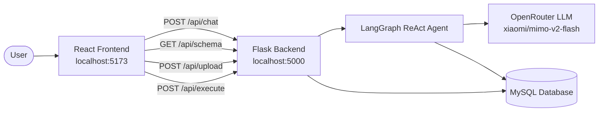

# NL2SQL — Natural Language to SQL Assistant

Ask questions about your data in plain English and get SQL queries, answers, and interactive results — powered by a **LangGraph ReAct agent**, **MySQL**, and **OpenRouter**.


---

## Table of Contents

- [Overview](#overview)
- [Features](#features)
- [Tech Stack](#tech-stack)
- [Architecture](#architecture)
- [Prerequisites](#prerequisites)
- [Installation](#installation)
- [Environment Variables](#environment-variables)
- [Load Sample Data](#load-sample-data)
- [Running the Application](#running-the-application)
- [How to Use](#how-to-use)
- [API Reference](#api-reference)
- [Project Structure](#project-structure)
- [Sample Database Schema](#sample-database-schema)
- [Troubleshooting](#troubleshooting)
- [Security Notes](#security-notes)

---

## Overview

**NL2SQL** is a full-stack Text-to-SQL application. Users can:

1. Browse database schemas in a sidebar explorer
2. Ask natural language questions about their data
3. View the AI-generated SQL query
4. Execute the query and see results in a table
5. Upload their own CSV/Excel datasets to create new databases on the fly

The backend uses a **LangChain SQL agent** (ReAct pattern via LangGraph) connected to **MySQL**. The LLM runs through **OpenRouter** using the free `xiaomi/mimo-v2-flash:free` model.

---

## Features

| Feature | Description |
|---|---|
| **Natural Language Queries** | Ask questions like *"What are the top 5 products by revenue?"* |
| **SQL Generation** | Agent inspects schema, writes SQL, validates, and executes it |
| **Schema Explorer** | Live sidebar showing databases, tables, and column types |
| **Query Execution** | One-click "Execute Query" button to run generated SQL |
| **Dataset Upload** | Drag-and-drop CSV/Excel files to create new MySQL tables |
| **Multi-Database Support** | Switch between databases from the UI |
| **Rate Limit Handling** | Exponential backoff on API rate limits (429 errors) |
| **Read-Only Safety** | Agent is restricted from DML; manual execute only allows SELECT |

---

## Tech Stack

### Backend
- **Python 3.10+**
- **Flask** — REST API
- **LangChain + LangGraph** — SQL ReAct agent
- **SQLAlchemy + PyMySQL** — MySQL connectivity
- **Pandas** — CSV/Excel ingestion
- **OpenRouter** — LLM API (OpenAI-compatible)

### Frontend
- **React 19** + **Vite 7**
- **Axios** — API calls
- **React Markdown** — Formatted AI responses
- **Lucide React** — Icons

### Database
- **MySQL 8+**

---

## Architecture



**Request flow for a chat query:**

1. User sends a natural language question from the React UI
2. Flask receives it at `POST /api/chat`
3. LangGraph agent uses SQL toolkit tools to inspect schema and run queries
4. Agent returns a natural language answer + the SQL it used
5. Frontend displays the answer and SQL; user can click **Execute Query** to see tabular results

---

## Prerequisites

Install these before getting started:

| Tool | Version | Download |
|---|---|---|
| **Python** | 3.10 or higher | [python.org](https://www.python.org/downloads/) |
| **Node.js** | 18 or higher | [nodejs.org](https://nodejs.org/) |
| **MySQL** | 8.0 or higher | [dev.mysql.com](https://dev.mysql.com/downloads/) |
| **Git** | Any recent version | [git-scm.com](https://git-scm.com/) |
| **OpenRouter API Key** | Free tier works | [openrouter.ai/keys](https://openrouter.ai/keys) |

Make sure MySQL is **running** and you know your root (or user) credentials.

---

## Installation

### 1. Clone the repository

```bash
git clone https://github.com/hkpatel321/NL2SQL-.git
cd NL2SQL-
```

### 2. Set up the Python backend

```bash
# Create and activate a virtual environment
python -m venv venv

# Windows
venv\Scripts\activate

# macOS / Linux
source venv/bin/activate

# Install dependencies
pip install -r requirements.txt
```

### 3. Set up the React frontend

```bash
cd frontend
npm install
cd ..
```

---

## Environment Variables

Create a `.env` file in the **project root** (same folder as `app.py`):

```env
DB_USER=root
DB_PASSWORD=your_mysql_password
DB_HOST=localhost
DB_PORT=3306
OPENROUTER_API_KEY=your_openrouter_api_key
```

| Variable | Required | Description |
|---|---|---|
| `DB_USER` | Yes | MySQL username |
| `DB_PASSWORD` | Yes | MySQL password |
| `DB_HOST` | No | MySQL host (default: `localhost`) |
| `DB_PORT` | No | MySQL port (default: `3306`) |
| `OPENROUTER_API_KEY` | Yes | API key from [OpenRouter](https://openrouter.ai/keys) |

> **Never commit your `.env` file.** It is already listed in `.gitignore`.

---

## Load Sample Data

The repo includes sample regional sales CSV files. Load them into MySQL with:

```bash
# Make sure venv is activated and .env is configured
python load_data.py
```

This will:
1. Create the `regional_sales_data` database (if it doesn't exist)
2. Load 6 CSV files into these tables:

| CSV File | MySQL Table |
|---|---|
| `2017_Budgets.csv` | `2017_budgets` |
| `Customers.csv` | `customers` |
| `Products.csv` | `products` |
| `Regions.csv` | `regions` |
| `sales_order.csv` | `sales_order` |
| `State_Regions.csv` | `state_regions` |

You should see output like:

```
Connecting to MySQL at localhost:3306 as root...
Creating database 'regional_sales_data' if it doesn't exist...
Loading Customers.csv into table 'customers'...
Successfully loaded 100 rows into 'customers'.
...
Data loading complete.
```

---

## Running the Application

You need **two terminals** — one for the backend, one for the frontend.

### Terminal 1 — Backend (Flask)

```bash
# From project root, with venv activated
python app.py
```

Backend runs at: **http://localhost:5000**

Verify it's working:

```bash
curl http://localhost:5000/health
```

Expected response:

```json
{
  "status": "healthy",
  "service": "Text-to-SQL Backend",
  "model": "Claude Sonnet via OpenRouter"
}
```

### Terminal 2 — Frontend (React + Vite)

```bash
cd frontend
npm run dev
```

Frontend runs at: **http://localhost:5173**

Open **http://localhost:5173** in your browser.

---

## How to Use

### 1. Explore the schema

- The **Schema Explorer** sidebar lists all databases on your MySQL server
- Select `regional_sales_data` from the dropdown
- Click table names to expand and view columns + types

### 2. Ask a question

Type a natural language question in the chat input, for example:

```
How many customers are there?
```

```
What are the top 5 products by total sales?
```

```
Show me all regions and their budgets for 2017
```

The assistant will:
- Inspect the relevant tables
- Generate a SQL query
- Return a natural language answer

### 3. Execute the SQL

When the assistant returns a query, click **Execute Query** to run it and see results in an interactive table (up to 100 rows).

### 4. Upload your own data

1. Click **Upload Dataset** in the header
2. Drag & drop a `.csv`, `.xlsx`, or `.xls` file
3. Set a **database name** (default: `user_data`) and **table name**
4. Click **Upload Dataset**
5. The app switches to your new database — start asking questions!

---

## API Reference

| Method | Endpoint | Description |
|---|---|---|
| `GET` | `/health` | Health check |
| `GET` | `/api/databases` | List all non-system databases |
| `GET` | `/api/schema/<db_name>` | Get tables and columns for a database |
| `POST` | `/api/chat` | Send a natural language query |
| `POST` | `/api/execute` | Execute a SELECT query manually |
| `POST` | `/api/upload` | Upload CSV/Excel file (multipart form) |

### `POST /api/chat`

**Request body:**

```json
{
  "query": "How many customers are there?",
  "database": "regional_sales_data"
}
```

**Response:**

```json
{
  "response": "There are 100 customers in the database.",
  "sql_query": "SELECT COUNT(*) FROM customers LIMIT 5",
  "database": "regional_sales_data"
}
```

### `POST /api/execute`

**Request body:**

```json
{
  "query": "SELECT * FROM customers LIMIT 10",
  "database": "regional_sales_data"
}
```

**Response:**

```json
{
  "success": true,
  "data": [{ "customer_id": 1, "name": "..." }],
  "columns": ["customer_id", "name"],
  "row_count": 10
}
```

### `POST /api/upload`

**Form fields:**

| Field | Type | Description |
|---|---|---|
| `file` | File | CSV or Excel file |
| `database` | String | Target database name |
| `table_name` | String | Optional table name (auto-generated from filename if omitted) |

---

## Project Structure

```
NL2SQL-/
├── app.py                          # Flask API + LangGraph SQL agent
├── database_manager.py             # DB operations (upload, schema, execute)
├── load_data.py                    # Script to load sample CSV data
├── requirements.txt                # Python dependencies
├── .gitignore
├── README.md
│
├── Data_CSV-20251208T122252Z-3-001/
│   └── Data_CSV/                   # Sample CSV datasets
│       ├── 2017_Budgets.csv
│       ├── Customers.csv
│       ├── Products.csv
│       ├── Regions.csv
│       ├── sales_order.csv
│       └── State_Regions.csv
│
└── frontend/
    ├── package.json
    ├── vite.config.js
    └── src/
        ├── App.jsx
        └── components/
            ├── ChatInterface.jsx   # Main chat UI
            ├── SchemaExplorer.jsx  # Sidebar schema browser
            ├── DatasetUpload.jsx   # File upload modal
            └── ResultsTable.jsx    # Query results table
```

---

## Sample Database Schema

After running `load_data.py`, the `regional_sales_data` database contains:

```
regional_sales_data
├── 2017_budgets      — Regional budget data for 2017
├── customers         — Customer records
├── products          — Product catalog
├── regions           — Geographic regions
├── sales_order       — Sales transactions
└── state_regions     — State-to-region mappings
```

Use the Schema Explorer in the UI to inspect exact column names and types before querying.

---

## Troubleshooting

### `OPENROUTER_API_KEY environment variable not set`

Create a `.env` file in the project root with your OpenRouter API key. Restart the Flask server after adding it.

### MySQL connection refused

- Ensure MySQL is running (`services.msc` → MySQL on Windows, or `sudo systemctl start mysql` on Linux)
- Verify `DB_HOST`, `DB_PORT`, `DB_USER`, and `DB_PASSWORD` in `.env`
- Test manually: `mysql -u root -p -h localhost`

### Frontend can't reach backend (CORS / network errors)

- Confirm Flask is running on **port 5000**
- Confirm React dev server is on **port 5173**
- The frontend is hardcoded to `http://localhost:5000` — both must run locally

### Rate limit / 429 errors

The free OpenRouter model has rate limits. The backend retries with exponential backoff. If you still hit limits, wait 30–60 seconds between queries. The frontend also enforces a 2-second minimum between chat messages.

### No databases showing in Schema Explorer

Run `python load_data.py` first to create the sample database, or upload a dataset via the UI.

### `ModuleNotFoundError` for Python packages

Make sure your virtual environment is activated and run:

```bash
pip install -r requirements.txt
```

### Upload fails for Excel files

Excel support requires `openpyxl`. Install it if missing:

```bash
pip install openpyxl
```

---

## Security Notes

- **Never commit `.env`** — it contains your API key and database password
- The SQL agent is instructed to **block DML** (INSERT, UPDATE, DELETE, DROP)
- The `/api/execute` endpoint only allows **SELECT** queries
- Uploaded table/column names are **sanitized** to prevent SQL injection via identifiers
- For production use, add authentication, HTTPS, and stricter query validation

---

## Author

**[hkpatel321](https://github.com/hkpatel321)**

---

## License

This project is open source. Feel free to use, modify, and distribute.
